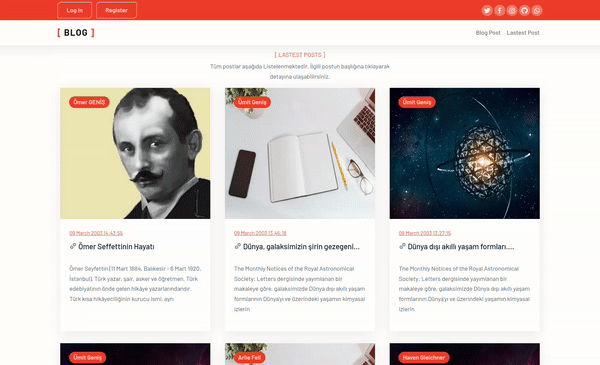

#  BlogApp

A Blog App which created with Laravel. BlogApp is 100% responsive and looks great on every device.

## Preview

Click demo to try it by yourself!

## BlogApp Demo Link

You can view the site here [Click Me](https://blogApp)

## Topics

- Laravel
- PostgreSQL
- Bootstrap 5
- HTML5 and CSS3
- 100% responsive
- Cross browser compatibility
- Single page website
- On hover effects
- Content Slider
- Call to action button
- Footer navigation
- Social media icons
- Google fonts

## Libraries & Plugins
- Laravel
- Bootstrap 5
- jQuery
- Google fonts
- Boxicons

***
### Author

* [Ümit GENİŞ](https://github.com/umitgenis/)

### `composer install`

Runs the app in the development mode.
Open http://localhost:8090 to view it in the browser.

The page will reload if you make edits.
